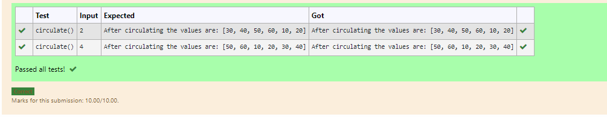

# Circulate-the-values-of-N-variables
## Aim:
To write a python program to circulate the n variables using function concept
## Equipment’s required:
PC
Anaconda - Python 3.7
## Algorithm: 
### Step 1:
define circulate function 
### Step 2: 
declare the element of n values
### Step 3: 
Get the value from the user for the number of rotation
### Step 4: 
Using the slicing concept rotate the list
### Step 5: 
circulate the given elements by slicing technique
### Step 6: 
print circulate
## Program:
```
#Program to circulate N values.
#Developed by:Haridharshini.s
#RegisterNumber:21500176
def circulate():
    a=[10,20,30,40,50,60]
    n=int(input())
    circulate=a[n:]+a[:n]
    print("After circulating the values are:",circulate)
```
## Output:


## Result:
thus the circulating the values of N variables are successfully executed